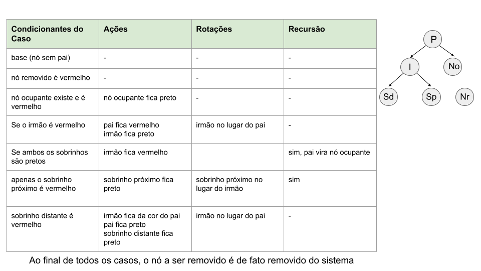

# Exclusão em Árvores Rubro-Negras (Red-Black Trees)

## Introdução

A exclusão em uma Árvore Rubro-Negra (Red-Black Tree) é uma das operações mais complexas dessa estrutura de dados. O objetivo é remover um nó mantendo todas as propriedades da árvore:

1. Todo nó é vermelho ou preto.
2. A raiz é sempre preta.
3. Nós vermelhos não podem ter filhos vermelhos.
4. Todo caminho da raiz até uma folha NIL possui a mesma quantidade de nós pretos.
5. Todas as folhas NIL são pretas.

A remoção ocorre em duas etapas:

1. Remover o nó como em uma Árvore Binária de Busca (BST).
2. Corrigir possíveis violações das propriedades rubro-negras.

---

# Etapa 1 — Remoção BST

Existem três possibilidades:

## Caso A — Nó folha

O nó é removido diretamente.

## Caso B — Nó com um filho

O filho substitui o nó removido.

## Caso C — Nó com dois filhos

Troca-se o valor do nó com seu sucessor em ordem (menor elemento da subárvore direita) e remove-se o sucessor. O sucessor terá no máximo um filho, reduzindo o problema para os casos anteriores.

---

# Casos Simples

## 1. Nó removido é vermelho

Se o nó removido for vermelho:

- Nenhuma propriedade da árvore é violada.
- Não há necessidade de rotações nem recolorações.

```text
Remover nó vermelho
→ Fim
```

---

## 2. Nó removido é preto e possui filho vermelho

O filho vermelho substitui o nó removido.

Depois:

```text
Filho ← PRETO
```

Isso restaura a quantidade de nós pretos nos caminhos da árvore.

---

# Problema do "Duplo Preto"

A situação realmente complicada ocorre quando:

- Um nó preto é removido;
- O nó substituto também é preto (ou NIL).

Nesse caso surge o conceito de **duplo preto** (*double black*).

O nó substituto passa a representar um "preto extra", criando desequilíbrio na altura negra da árvore.

---

# Correção do Duplo Preto

Considere:

```text
P = pai
S = irmão (sibling)
N = nó duplo preto
```

Além disso:

```text
Sobrinho Próximo = filho de S do lado de N
Sobrinho Distante = filho de S do lado oposto a N
```

---

# Caso 1 — Irmão Vermelho

## Condição

```text
S é vermelho
```

Estrutura:

```text
      P(B)
     /    \
   N      S(R)
```

## Ações

1. Rotação em torno de P.
2. Troca de cores entre P e S.
3. Reavaliar os casos.

## Objetivo

Transformar a situação em um caso onde o irmão seja preto.

---

# Caso 2 — Irmão Preto com Dois Filhos Pretos

## Condição

```text
S é preto
sobrinho próximo é preto
sobrinho distante é preto
```

Estrutura:

```text
        P(?)
       /    \
      N     S(B)
           /   \
         B      B
```

## Ações

1. Pintar S de vermelho.
2. Remover um preto de N.
3. Transferir o problema para P.

### Se P era vermelho

```text
P torna-se preto
Fim
```

### Se P era preto

```text
P torna-se duplo preto
Continuar correção
```

Esse é o único caso que pode propagar o problema para níveis superiores da árvore.

---

# Caso 3 — Irmão Preto e Sobrinho Distante Vermelho

## Condição

```text
S preto
sobrinho distante vermelho
```

Exemplo:

```text
       P
      / \
     N   S(B)
        /   \
      B     R
```

## Ações

1. Rotação em P.
2. S recebe a cor de P.
3. P torna-se preto.
4. Sobrinho distante torna-se preto.

## Resultado

O duplo preto é eliminado imediatamente.

Este é o caso que encerra a correção de forma definitiva.

---

# Caso 4 — Irmão Preto e Sobrinho Próximo Vermelho

## Condição

```text
S preto
sobrinho próximo vermelho
sobrinho distante preto
```

Exemplo:

```text
       P
      / \
     N   S(B)
        /   \
      R      B
```

## Ações

1. Rotação em S.
2. Troca de cores entre S e sobrinho próximo.

Resultado:

```text
Caso 4 → transforma em Caso 3
```

Após isso executa-se imediatamente o Caso 3.

---

# Caso Especial — Duplo Preto na Raiz

## Condição

O nó duplo preto chega à raiz.

## Ação

Remover a marca de duplo preto.

```text
Raiz ← preta
```

Fim da correção.

---

# Fluxograma Mental da Exclusão

```text
Remover nó

├── Nó removido vermelho?
│      └── Sim → Fim
│
├── Filho substituto vermelho?
│      └── Sim → Pintar preto → Fim
│
└── Surge duplo preto
       │
       ├── Irmão vermelho?
       │      └── Caso 1
       │
       ├── Irmão preto e filhos pretos?
       │      └── Caso 2
       │
       ├── Irmão preto e sobrinho distante vermelho?
       │      └── Caso 3
       │
       └── Irmão preto e sobrinho próximo vermelho?
              └── Caso 4 → Caso 3
```

---

# Resumo dos Casos

| Caso | Condição | Ação Principal |
|--------|----------|---------------|
| Nó removido vermelho | Nó vermelho | Apenas remove |
| Nó preto com filho vermelho | Filho vermelho substitui | Filho vira preto |
| Caso 1 | Irmão vermelho | Rotação + troca de cores |
| Caso 2 | Irmão preto e sobrinhos pretos | Recoloração e sobe problema |
| Caso 3 | Irmão preto e sobrinho distante vermelho | Rotação final |
| Caso 4 | Irmão preto e sobrinho próximo vermelho | Rotação preparatória |
| Raiz duplo preta | Duplo preto na raiz | Remove duplo preto |

---

# Complexidade

A exclusão mantém a altura da árvore em:

```text
O(log n)
```

porque cada correção percorre no máximo a altura da árvore e realiza um número constante de rotações por nível.

---

# Resumo Rápido para Implementação

```text
1. Remover nó como BST.
2. Se nó removido era vermelho:
      terminar.
3. Se substituto é vermelho:
      pintar substituto de preto.
4. Caso contrário:
      criar situação de duplo preto.
5. Enquanto existir duplo preto:
      Caso 1 → irmão vermelho.
      Caso 2 → irmão preto e filhos pretos.
      Caso 3 → irmão preto e sobrinho distante vermelho.
      Caso 4 → irmão preto e sobrinho próximo vermelho.
6. Garantir raiz preta.

```

