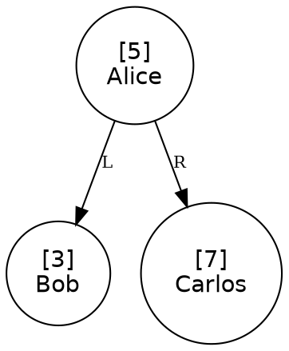

# Melhorias — 16/06/2026

## Atividade — Opção [4] Árvore Binária de Busca (ABB)

### O que foi feito

Implementação completa da estrutura de dados **Árvore Binária de Busca (ABB)** integrada ao programa existente como uma quarta opção no menu inicial. Os arquivos `ArvBin.h` e `ArvBin.c` foram reescritos com todas as operações e visualização gráfica via Graphviz.

---

### O que é uma Árvore Binária de Busca

Uma ABB é uma árvore onde cada nó obedece à seguinte propriedade:

```
todos os nós da subárvore ESQUERDA têm id < id do nó atual
todos os nós da subárvore DIREITA  têm id > id do nó atual
```

Essa propriedade vale para **todo nó** da árvore, não apenas para a raiz. Ela garante que operações de busca, inserção e remoção funcionem em **O(log n)** no caso médio — sem precisar comparar com todos os elementos.

Exemplo com os ids 5, 3, 7, 1, 4:

```
        5
       / \
      3   7
     / \
    1   4
```

Percorrendo da esquerda para a direita em qualquer nível, os valores sempre aparecem em ordem crescente.

---

### Estrutura de dados utilizada

Definida em `ArvBin.h`:

```c
typedef struct NoArvBin {
    int id;               // chave de comparação: define a posição do nó na ABB
    char nome[100];       // dado satélite: informação associada ao id
    struct NoArvBin *esq; // filho esquerdo — contém ids menores
    struct NoArvBin *dir; // filho direito  — contém ids maiores
} NoArvBin;
```

A árvore inteira é referenciada por um único ponteiro global em `main.c`:

```c
NoArvBin *raiz_abb = NULL;
```

Inicialmente `NULL` (árvore vazia). Cada inserção pode atualizar esse ponteiro (se a árvore estiver vazia, o primeiro nó inserido se torna a raiz).

---

### Funções implementadas em `ArvBin.c`

#### `criarNo(int id, const char *nome)`
Aloca um novo nó na memória heap com `malloc`, preenche `id` e `nome`, e define `esq = dir = NULL`. Um nó recém-criado é sempre uma folha (sem filhos).

#### `inserir(NoArvBin *raiz, int id, const char *nome)`
Localiza recursivamente a posição correta seguindo a propriedade da ABB:

```
id < raiz->id  →  desce à esquerda
id > raiz->id  →  desce à direita
id == raiz->id →  duplicata, ignora
```

Usa o padrão **"retornar e reatribuir"**: cada chamada retorna a raiz da subárvore, e o pai atualiza seu ponteiro filho com esse retorno. Assim, quando `criarNo` é chamado no fundo da recursão, o ponteiro correto é atualizado automaticamente ao subir.

#### `remover(NoArvBin *raiz, int id)`
Navega até o nó e aplica um dos três casos:

| Caso | Situação | Solução |
|---|---|---|
| 1 | Sem filho esquerdo | Substitui o nó pelo filho direito (ou NULL) |
| 2 | Sem filho direito | Substitui o nó pelo filho esquerdo |
| 3 | Dois filhos | Copia os dados do **sucessor** (mínimo da subárvore direita) para o nó atual, depois remove o sucessor original (que sempre cai no caso 1 ou 2) |

O caso 3 preserva a propriedade da ABB porque o sucessor em ordem é, por definição, o menor valor maior que o nó removido — ele pode ocupar esse lugar sem violar nenhuma regra.

---

### Travessias (percursos da árvore)

Todas as três travessias são **recursivas**. O caso base em todas é `atual == NULL` — ao chegar numa folha ou subárvore vazia, a função simplesmente retorna sem fazer nada.

#### `InOrder` — esq → raiz → dir

Visita a subárvore esquerda inteira, depois o nó atual, depois a direita. Como a esquerda sempre tem valores menores e a direita sempre maiores, o resultado é a sequência de ids em **ordem crescente**.

```
InOrder(5) → InOrder(3) → InOrder(1) → imprime 1 → imprime 3 → InOrder(4) → imprime 4 → imprime 5 → InOrder(7) → imprime 7
Saída: 1 3 4 5 7
```

**Uso:** listar todos os valores ordenados.

#### `PreOrder` — raiz → esq → dir

Visita o nó atual **antes** dos filhos. Propriedade importante: se os valores forem inseridos nessa mesma ordem em uma nova ABB vazia, a estrutura resultante será **exatamente igual** à original.

```
PreOrder(5) → imprime 5 → PreOrder(3) → imprime 3 → PreOrder(1) → imprime 1 → PreOrder(4) → imprime 4 → PreOrder(7) → imprime 7
Saída: 5 3 1 4 7
```

**Uso:** serializar/salvar a árvore de forma que possa ser reconstruída nó a nó.

#### `PostOrder` — esq → dir → raiz

Visita o nó atual **depois** de ambos os filhos. Garante que nenhum pai seja processado antes de seus descendentes.

```
PostOrder(5) → PostOrder(3) → PostOrder(1) → imprime 1 → PostOrder(4) → imprime 4 → imprime 3 → PostOrder(7) → imprime 7 → imprime 5
Saída: 1 4 3 7 5
```

**Uso:** liberar memória da árvore com `free` — os filhos são liberados antes do pai, evitando ponteiros perdidos.

---

### Consultas de extremo

#### `minimo(NoArvBin *no)`
Desce sempre pela esquerda até não haver mais filho esquerdo. O nó mais à esquerda é, por definição, o menor da subárvore.

```c
while (no->esq != NULL) no = no->esq;
return no;
```

#### `maximo(NoArvBin *no)`
Simétrico ao `minimo`: desce sempre pela direita.

```c
while (no->dir != NULL) no = no->dir;
return no;
```

---

### Sucessor e Antecessor em ordem

#### `sucessor(NoArvBin *raiz, int id)`
Retorna o próximo valor **maior** que `id` na sequência crescente. Dois casos:

- **O nó tem filho direito:** o sucessor é o `minimo` da subárvore direita — o menor dos valores que são maiores que ele.
- **O nó não tem filho direito:** durante a descida até o nó, toda vez que vamos para a esquerda, guardamos o nó atual como `candidato`. O último `candidato` gravado é o sucessor (foi o último ancestral pelo qual "subimos à esquerda").

Retorna `NULL` se o nó for o maior da árvore.

```
Árvore: 1 3 4 5 7
sucessor(3) → minimo(subárvore direita de 3) = 4
sucessor(7) → NULL (não há maior)
```

#### `antecessor(NoArvBin *raiz, int id)`
Simétrico ao `sucessor` (troca esquerda/direita e min/max):

- **O nó tem filho esquerdo:** antecessor é `maximo` da subárvore esquerda.
- **O nó não tem filho esquerdo:** o `candidato` é o último ancestral pelo qual descemos à direita.

Retorna `NULL` se o nó for o menor da árvore.

```
Árvore: 1 3 4 5 7
antecessor(4) → maximo(subárvore esquerda de 4) = 3
antecessor(1) → NULL (não há menor)
```

---

### Visualização gráfica (`visualizarABBDot`)

Funciona com o mesmo mecanismo da visualização de grafos já existente no programa: gera um arquivo `.dot` e chama o Graphviz para converter em imagem `.png`.

#### Fluxo completo

```
árvore em memória → arvore.dot → dot -Tpng → arvore.png → start arvore.png
```

#### Formato do arquivo `.dot` gerado



- `digraph` (grafo dirigido) porque as arestas pai → filho têm sentido.
- `ordering="out"` garante que o filho esquerdo apareça à esquerda do direito no layout.
- As arestas são rotuladas com `L` (filho esquerdo) ou `R` (filho direito).
- O label de cada nó mostra `[id]` na primeira linha e `nome` na segunda.

#### Funções auxiliares internas

Ambas são `static` — visíveis apenas dentro de `ArvBin.c`, sem poluir o namespace global.

- `escreverNos(FILE *f, NoArvBin *no)` — percorre em pré-ordem e escreve a linha de cada nó.
- `escreverArestas(FILE *f, NoArvBin *no)` — percorre em pré-ordem e escreve as arestas existentes (não escreve aresta para filhos `NULL`).

Se o Graphviz não estiver instalado, o programa informa o comando de instalação e exibe o link para visualizar o `.dot` online:
```
https://dreampuf.github.io/GraphvizOnline
```

---

### Alterações em `main.c`

#### Menu inicial — nova opção [4]

```c
typedef enum {INVALIDO, GRAFICA, LISTA, MATRIZ, ABB} GRAFOMETODO;
```

```
[1] Grafos com representação gráfica
[2] Grafo com lista de adjacência
[3] Grafo com matriz de adjacência
[4] Árvore binária de busca (ABB)   ← novo
```

Ao selecionar `[4]`, as perguntas de "ponderado" e "dirigido" são puladas — não fazem sentido para uma árvore.

#### Variável global da raiz

```c
NoArvBin *raiz_abb = NULL;
```

Declarada em escopo global para persistir entre operações do menu. As funções `abb_inserir` e `abb_remover` atualizam esse ponteiro com o retorno de `inserir` e `remover`.

#### Submenu da ABB

```
=== Árvore Binária de Busca ===
[1]  Inserir valor
[2]  Remover valor
[3]  Valor mínimo
[4]  Valor máximo
[5]  Sucessor de um nó
[6]  Antecessor de um nó
[7]  Visualizar In-order  (ordem crescente)
[8]  Visualizar Pre-order (reconstrução da árvore)
[9]  Visualizar Post-order (ordem para liberar memória)
[10] Ver ABB graficamente
[0]  SAIR
```

---

### Resumo das operações e suas complexidades

| Operação | Caso médio | Pior caso (árvore degenerada) |
|---|---|---|
| Inserir | O(log n) | O(n) |
| Remover | O(log n) | O(n) |
| Mínimo / Máximo | O(log n) | O(n) |
| Sucessor / Antecessor | O(log n) | O(n) |
| InOrder / PreOrder / PostOrder | O(n) | O(n) |

> O pior caso ocorre quando os elementos são inseridos em ordem crescente ou decrescente — a árvore vira uma lista encadeada. Para garantir O(log n) sempre, seria necessária uma **Árvore Rubro-Negra** (implementada em `ArvRN.c`).
