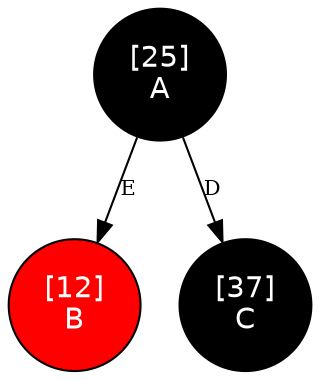

# Melhorias — 27/06/2026

## Atividade 1 — Opção [5] Árvore Rubro-Negra (ARN)

### O que foi feito

Implementação completa da estrutura de dados **Árvore Rubro-Negra (ARN)** integrada ao programa como quinta opção no menu inicial. Os arquivos `ArvRN.h` e `ArvRN.c` foram criados do zero com inserção, remoção, visualização gráfica colorida via Graphviz e a lógica de balanceamento automático.

---

### O que é uma Árvore Rubro-Negra

A ARN é uma **Árvore Binária de Busca com balanceamento automático**. Ela resolve o principal problema da ABB simples: quando elementos são inseridos em ordem crescente ou decrescente, a ABB degenera em uma lista encadeada e as operações passam de O(log n) para O(n).

A ARN garante **O(log n) no pior caso** para inserção, remoção e busca, sempre — independente da ordem de inserção. Ela faz isso mantendo cinco propriedades invariantes que limitam a diferença de altura entre qualquer dois caminhos da raiz até uma folha.

#### As 5 propriedades invariantes

Toda Árvore Rubro-Negra válida obedece simultaneamente às seguintes regras:

| # | Propriedade |
|---|---|
| 1 | Todo nó é **VERMELHO** ou **PRETO** |
| 2 | A **raiz** é sempre **PRETA** |
| 3 | Toda **folha** (nó NIL sentinela) é **PRETA** |
| 4 | Se um nó é **VERMELHO**, ambos os seus filhos são **PRETOS** (não existem dois vermelhos consecutivos) |
| 5 | Para todo nó, todos os caminhos simples daquele nó até folhas descendentes possuem o mesmo número de nós **PRETOS** (**altura-negra**) |

A propriedade 4 impede que a árvore cresça demais em um lado, e a propriedade 5 garante que nenhum caminho seja mais que o dobro do comprimento de outro — o que limita a altura máxima a `2 · log₂(n+1)`.

#### Comparação com a ABB

| | ABB | ARN |
|---|---|---|
| Inserção | O(log n) médio / O(n) pior caso | **O(log n) sempre** |
| Remoção | O(log n) médio / O(n) pior caso | **O(log n) sempre** |
| Implementação | Simples | Mais complexa (rotações + fixup) |
| Balanceamento | Nenhum — depende da ordem de inserção | Automático após cada operação |

```
Inserindo 1, 2, 3, 4, 5 em ordem crescente:

ABB (degenerada):         ARN (balanceada):
1                               2
 \                            /   \
  2                          1     4
   \                              / \
    3                            3   5
     \
      4
       \
        5
```

---

### Estrutura de dados utilizada

Definida em `ArvRN.h`:

```c
#define VERMELHO 0
#define PRETO    1

typedef struct NoARN {
    int id;            // chave de comparação: define a posição na ARN
    char nome[100];    // dado satélite: informação associada ao id
    int cor;           // VERMELHO (0) ou PRETO (1)
    struct NoARN *esq; // filho esquerdo  — ids menores
    struct NoARN *dir; // filho direito   — ids maiores
    struct NoARN *pai; // ponteiro para o nó pai (necessário para rotações e fixups)
} NoARN;
```

A diferença principal em relação ao `NoArvBin` é o campo `cor` e o ponteiro `pai`. O ponteiro `pai` é necessário porque os fixups de inserção e remoção precisam subir na árvore sem precisar de recursão.

#### O nó sentinela NIL_ARN

Em vez de usar `NULL` para representar folhas e filhos inexistentes, a ARN usa um **nó sentinela** — um único nó PRETO estático compartilhado por toda a árvore que representa todas as folhas simultaneamente:

```c
static NoARN NIL_NODE = {0, "", PRETO, NULL, NULL, NULL};
NoARN *NIL_ARN = &NIL_NODE;
```

Ao inicializar (`inicializarARN`), a sentinela aponta para si mesma em `esq`, `dir` e `pai`, formando um ciclo:

```c
NIL_NODE.esq = NIL_ARN;
NIL_NODE.dir = NIL_ARN;
NIL_NODE.pai = NIL_ARN;
```

**Por que usar sentinela em vez de NULL?**
As rotações e os fixups precisam acessar `no->pai->cor`, `no->pai->esq`, etc. Se o pai fosse `NULL`, qualquer dessas acessos causaria falha de segmentação. Com a sentinela (sempre PRETO e com ponteiros válidos para si mesma), essas acessos são seguros sem nenhuma verificação de NULL explícita.

A árvore em `main.c` é referenciada por:

```c
NoARN *raiz_arn = NULL;
```

E inicializada com `inicializarARN(&raiz_arn)`, que configura a sentinela e define `raiz_arn = NIL_ARN` (árvore vazia).

---

### Rotações

As rotações são a operação primitiva que move nós para reequilibrar a árvore. Elas **preservam a propriedade de ordem** da BST (esq < raiz < dir) e apenas reorganizam os ponteiros.

#### `rotacaoEsq(NoARN **raiz, NoARN *x)`

O nó `y` (filho direito de `x`) "sobe" e `x` desce para a esquerda de `y`:

```
Antes:          Depois:
    x               y
   / \             / \
  A   y    →      x   C
     / \         / \
    B   C       A   B
```

#### `rotacaoDir(NoARN **raiz, NoARN *x)`

Simétrica à `rotacaoEsq`: o nó `y` (filho esquerdo de `x`) sobe e `x` desce para a direita de `y`:

```
Antes:          Depois:
    x               y
   / \             / \
  y   C    →      A   x
 / \                 / \
A   B               B   C
```

Ambas as funções atualizam: o ponteiro do pai de `x` para apontar para `y`, o `pai` de `y` para o antigo pai de `x`, e o `pai` do filho transferido (B) para `x`.

---

### Inserção

#### `inserirARN(NoARN **raiz, int id, const char *nome)`

A inserção funciona em duas etapas:

**Etapa 1 — Inserção como BST comum:**
Navega pela árvore exatamente como a ABB (esquerda se menor, direita se maior) até encontrar uma posição NIL. Cria o nó com `malloc`, define `cor = VERMELHO` e o coloca na posição encontrada.

O novo nó é sempre inserido como **VERMELHO** porque isso pode violar apenas a propriedade 4 (dois vermelhos consecutivos), mas nunca a propriedade 5 (altura-negra). Seria muito mais difícil corrigir uma violação da propriedade 5.

**Etapa 2 — `fixupInserir`: restauração das propriedades:**

O fixup sobe pela árvore enquanto o pai do nó atual for VERMELHO (indicando violação da propriedade 4). A cada iteração, considera três casos baseados na **cor do tio** (irmão do pai):

| Caso | Condição | Solução |
|---|---|---|
| 1 | Tio é **VERMELHO** | Recolorir: pai → PRETO, tio → PRETO, avô → VERMELHO. Sobe `z` ao avô e repete. |
| 2 | Tio é **PRETO**, `z` forma "triângulo" com pai e avô | Rotação no pai transforma triângulo em linha reta. Cai no Caso 3. |
| 3 | Tio é **PRETO**, `z` forma "linha reta" com pai e avô | Recolorir pai → PRETO, avô → VERMELHO + rotação no avô. Termina. |

```
Caso 1 (tio vermelho):         Caso 3 (linha reta, lado esquerdo):
      avô(B)                         avô(V)
      /    \                         /    \
   pai(V) tio(V)       →          pai(B)  C
    /                              /
   z(V)                           z(V)
   ↓ recolorir                    ↓ rotacaoDir(avô)
      avô(V)                         pai(B)
      /    \                         /    \
   pai(B) tio(B)                   z(V)  avô(V)
    /                                       \
   z(V)                                      C
```

Ao final, a raiz é forçada para PRETO (propriedade 2).

---

### Remoção

#### `removerARN(NoARN **raiz, int id)`

A remoção também funciona em duas etapas.

**Etapa 1 — Busca e desvinculação:**

Encontra o nó `z` com o `id` dado (se não existir, imprime mensagem e retorna). Em seguida aplica um dos três casos:

| Caso | Condição | Solução |
|---|---|---|
| A | `z` não tem filho esquerdo | `transplant(z, z->dir)`: filho direito sobe |
| B | `z` não tem filho direito | `transplant(z, z->esq)`: filho esquerdo sobe |
| C | `z` tem dois filhos | Encontra o sucessor `y` (mínimo da subárvore direita), copia os dados de `y` para `z`, depois remove `y` (que cai nos casos A ou B) |

A função auxiliar `transplant(u, v)` substitui a subárvore com raiz `u` pela subárvore com raiz `v`, atualizando o ponteiro do pai de `u`.

**Etapa 2 — `fixupRemover`: restauração das propriedades:**

O fixup só é necessário quando o nó removido era **PRETO** (a remoção de um nó vermelho não afeta a altura-negra). O nó `x` que subiu para o lugar do removido carrega um "débito" de negrura extra que precisa ser distribuído.

O loop sobe pela árvore com quatro casos baseados na **cor do irmão** de `x`:

| Caso | Condição | Solução |
|---|---|---|
| 1 | Irmão é **VERMELHO** | Rotação + recolorir. Converte em Caso 2, 3 ou 4. |
| 2 | Irmão é **PRETO**, filhos do irmão são **PRETOS** | Recolorir irmão → VERMELHO. Sobe `x` ao pai. |
| 3 | Irmão é **PRETO**, filho próximo do irmão é **VERMELHO** | Rotação + recolorir. Converte em Caso 4. |
| 4 | Irmão é **PRETO**, filho distante do irmão é **VERMELHO** | Rotação + recolorir. Termina o loop. |

Todos os quatro casos têm versões espelhadas (para quando `x` é filho direito em vez de esquerdo).

#### Mensagens de feedback da remoção

A função `removerARN` imprime mensagens em dois momentos:

```
ID não encontrado  →  "Nó [X] não encontrado na ARN."
Removido com êxito →  "Nó [X] removido com sucesso da ARN."
```

A função em `main.c` (`arn_remover`) também verifica se a árvore está vazia antes de pedir o ID:

```
Árvore vazia       →  "A árvore está vazia."
```

---

### Visualização gráfica (`visualizarARNDot`)

Gera `arvore_rn.dot` e abre `arvore_rn.png`, seguindo o mesmo fluxo da ABB:

```
árvore em memória → arvore_rn.dot → dot -Tpng → arvore_rn.png → start arvore_rn.png
```

#### Diferencial em relação à ABB: cores e rótulos de posição

Cada nó é renderizado com a cor correspondente à sua propriedade na ARN:



- `fillcolor=black` + `fontcolor=white` → nó PRETO
- `fillcolor=red` + `fontcolor=white` → nó VERMELHO
- Arestas rotuladas com `E` (filho **E**squerdo) e `D` (filho **D**ireito)

#### Funções auxiliares internas

Ambas são `static` — visíveis apenas dentro de `ArvRN.c`.

- `escreverNosARN(FILE *f, NoARN *no)` — percorre em pré-ordem, escreve cada nó com seus atributos de cor.
- `escreverArestasARN(FILE *f, NoARN *no)` — percorre em pré-ordem, escreve as arestas rotuladas com E/D. Só escreve aresta quando o filho existe (diferente de `NIL_ARN`).

#### Correção de bug: caracteres especiais no formato DOT

Foi identificado que nomes de nós contendo aspas duplas `"` quebravam o arquivo `.dot`, causando o erro:

```
Error: arvore_rn.dot: syntax error in line N near '"'
```

A causa: o formato DOT usa `"` para delimitar strings. Se o `nome` do nó contiver `"`, a string é fechada prematuramente e o parser falha.

A solução foi criar a função auxiliar `escreverTextoSeguro` em `ArvRN.c` (e também em `ArvBin.c`):

```c
static void escreverTextoSeguro(FILE *f, const char *str) {
    for (; *str; str++) {
        if (*str == '"' || *str == '\\') fputc('\\', f);
        fputc(*str, f);
    }
}
```

Ela percorre o `nome` caractere a caractere e, antes de qualquer `"` ou `\`, insere um `\` de escape. O resultado no arquivo `.dot` fica:

```
nome digitado: "A"   →   label="[1]\n\"A\""   (correto para o DOT)
```

---

### Alterações em `main.c`

#### Enum `GRAFOMETODO` — novo valor `ARN`

```c
typedef enum {INVALIDO, GRAFICA, LISTA, MATRIZ, ABB, ARN} GRAFOMETODO;
```

#### Variável global da raiz

```c
NoARN *raiz_arn = NULL;
```

Inicializada com `inicializarARN(&raiz_arn)` ao selecionar a opção 5 no menu inicial.

#### Menu inicial — nova opção [5]

```
[1] Grafos com representação gráfica
[2] Grafo com lista de adjacência
[3] Grafo com matriz de adjacência
[4] Árvore binária de busca (ABB)
[5] Árvore rubro negra (ARN)        ← novo
```

Ao selecionar `[5]`, as perguntas de "ponderado" e "dirigido" são puladas — não se aplicam a árvores.

#### Submenu da ARN

```
=== Árvore Rubro-Negra ===
[1] Inserir valor
[2] Remover valor
[3] Ver ARN graficamente
[4] Inserir dados dummies
[0] SAIR
```

#### Funções wrapper em `main.c`

```c
void arn_inserir()   // lê id e nome, chama inserirARN
void arn_remover()   // verifica árvore vazia, lê id, chama removerARN
void arn_visualizar()// chama visualizarARNDot
void arn_inserir_dummies() // veja seção de dados dummies abaixo
```

---

## Atividade 2 — Inserção de dados dummies

### O que foi feito

Adicionada a opção **"Inserir dados dummies"** em todos os três submenus: Grafos, ABB e ARN. Ao selecionar essa opção, 15 valores pré-definidos são inseridos automaticamente, permitindo testar a visualização e as operações sem precisar digitar dados manualmente.

---

### Dados pré-definidos compartilhados

Declarados como constantes globais em `main.c` para serem reutilizados pelas três funções:

```c
#define DUMMY_N 15

/* 15 chaves espalhadas entre 1 e 50 */
static const int DUMMY_IDS[DUMMY_N] = {
    25, 12, 37,  6, 18,
    30, 44,  3,  9, 15,
    22, 28, 35, 41, 48
};
```

Os IDs foram escolhidos propositalmente: inserir `25` primeiro (valor central) e depois valores nos dois lados produz uma **ABB/ARN visualmente equilibrada**, sem degeneração em lista.

Os nomes são gerados dinamicamente com `'A' + i`:

```c
char nome[4];
nome[0] = 'A' + i;  // A, B, C, D, E, F, G, H, I, J, K, L, M, N, O
nome[1] = '\0';
```

#### Estrutura que a ARN produz com esses dados

A ARN rebalanceia automaticamente após cada inserção. Inserindo os 15 IDs acima, a raiz será `25` (primeiro inserido, depois recolorido para preto), e a árvore ficará com altura ≤ 8 — garantida pela propriedade da altura-negra.

---

### `abb_inserir_dummies` — Árvore Binária de Busca

```c
void abb_inserir_dummies(){
    for(int i = 0; i < DUMMY_N; i++){
        char nome[4];
        nome[0] = 'A' + i; nome[1] = '\0';
        raiz_abb = inserir(raiz_abb, DUMMY_IDS[i], nome);
    }
    printf("15 valores (A–O, ids 1–50) inseridos com sucesso na ABB.\n");
}
```

Chama a mesma função `inserir` usada pela inserção manual. A raiz pode mudar (se a árvore estava vazia) e é sempre reatribuída com o retorno de `inserir`.

Acessível via opção `[11]` do submenu da ABB.

---

### `arn_inserir_dummies` — Árvore Rubro-Negra

```c
void arn_inserir_dummies(){
    for(int i = 0; i < DUMMY_N; i++){
        char nome[4];
        nome[0] = 'A' + i; nome[1] = '\0';
        inserirARN(&raiz_arn, DUMMY_IDS[i], nome);
    }
    printf("15 valores (A–O, ids 1–50) inseridos com sucesso na ARN.\n");
}
```

Usa os **mesmos 15 IDs** da ABB, permitindo comparar visualmente como as duas estruturas organizam os mesmos dados. Na ARN, após cada inserção o `fixupInserir` pode fazer rotações e recolorações — o resultado final será diferente da ABB para os mesmos dados.

Acessível via opção `[4]` do submenu da ARN.

---

### `grafo_inserir_dummies` — Grafos (GRAFICA / LISTA / MATRIZ)

Para grafos, a lógica é diferente: em vez de usar `DUMMY_IDS` como chaves de comparação, o programa insere 15 **vértices** com IDs sequenciais (controlados por `UNICID`) e depois adiciona arestas entre eles.

```c
static const int DUMMY_ARESTAS[19][2] = {
    {0,1},{1,2},{2,3},{3,4},{4,5},{5,6},{6,7},{7,8},{8,9},{9,10},
    {10,11},{11,12},{12,13},{13,14},        // caminho principal
    {0,5},{2,7},{4,9},{6,11},{8,13}         // arestas cruzadas
};
```

Os pares são **índices** (0 a 14) que referenciam posições no vetor `ids[]` local — não os IDs diretos, pois o UNICID pode ter qualquer valor inicial.

**Fluxo da função:**

```c
void grafo_inserir_dummies(){
    int ids[DUMMY_N];
    for(int i = 0; i < DUMMY_N; i++){
        ids[i] = UNICID++;               // registra o ID real atribuído
        char nome[4]; nome[0]='A'+i; nome[1]='\0';
        adicionarVertice*(ids[i], nome); // chama a função do método ativo
    }
    for(int i = 0; i < 19; i++){
        int a = ids[DUMMY_ARESTAS[i][0]];
        int b = ids[DUMMY_ARESTAS[i][1]];
        float p = (QUALPONDERACAO == EH_PONDERADO) ? (float)(i+1) : 0.0f;
        adicionarAresta*(a, b, p);       // chama a função do método ativo
    }
    printf("15 vértices (A–O) e 19 arestas inseridos com sucesso.\n");
}
```

- **14 arestas** formam um caminho que conecta todos os 15 vértices em sequência (A→B→C→…→O).
- **5 arestas cruzadas** criam ciclos, tornando o grafo mais interessante para visualização.
- Para grafos **ponderados**, os pesos são `1.0, 2.0, …, 19.0` (índice da aresta + 1).
- Para grafos **não ponderados**, o peso é `0.0` (ignorado pelas funções de exibição).
- A função detecta o método ativo (`GRAFMET`) e chama `adicionarVerticeGrafica/Lista/Matriz` e `adicionarArestaGrafica/Lista/Matriz` conforme necessário.

Acessível via opção `[7]` do submenu de grafos.

---

### Resumo das opções de menu adicionadas

| Submenu | Opção | Texto exibido |
|---|---|---|
| Grafos | `[7]` | Inserir dados dummies |
| ABB | `[11]` | Inserir dados dummies |
| ARN | `[4]` | Inserir dados dummies |

---

### Resumo das complexidades da ARN

| Operação | Complexidade |
|---|---|
| Inserção | O(log n) — sempre |
| Remoção | O(log n) — sempre |
| Busca | O(log n) — sempre |
| Rotações por operação | O(1) amortizado |
| Espaço extra por nó | O(1) — apenas o campo `cor` e o ponteiro `pai` |

> A principal vantagem da ARN sobre a ABB é a **garantia de O(log n) no pior caso**. O custo é a complexidade de implementação: as rotações e os fixups de inserção e remoção somam cerca de 4× mais código que a ABB equivalente.

---

## Atividade 3 — Saída de imagens na pasta `images/` e ajustes no `.gitignore`

### O que foi feito

Todos os arquivos gerados em tempo de execução (`.dot` e `.png`) foram redirecionados para a subpasta `images/`. O `.gitignore` foi revisado para que os executáveis `.exe` e a pasta `images/` sejam rastreados pelo git.

---

### Redirecionamento dos arquivos para `images/`

Anteriormente os arquivos `.dot` e `.png` eram gerados na raiz do projeto, misturados ao código-fonte. Agora são criados dentro de `images/`:

| Arquivo | Antes | Depois |
|---|---|---|
| Grafo (IACODES.c) | `grafo.dot` / `grafo.png` | `images/grafo.dot` / `images/grafo.png` |
| ABB (ArvBin.c) | `arvore.dot` / `arvore.png` | `images/arvore.dot` / `images/arvore.png` |
| ARN (ArvRN.c) | `arvore_rn.dot` / `arvore_rn.png` | `images/arvore_rn.dot` / `images/arvore_rn.png` |

A pasta `images/` é criada automaticamente ao iniciar o programa, antes do menu principal, usando a API do Windows em `main.c`:

```c
CreateDirectoryA("images", NULL); /* cria a pasta images/ se ainda não existir */
```

`CreateDirectoryA` retorna erro silenciosamente se a pasta já existir (`ERROR_ALREADY_EXISTS`), portanto nenhuma verificação adicional é necessária. A função já está disponível porque `<windows.h>` é incluído no início de `main.c`.

---

### Alterações no `.gitignore`

O `.gitignore` foi ajustado para que os arquivos gerados pelo projeto sejam versionados normalmente:

```
# Binários compilados
*.o
*.out

#arquivos claude
CLAUDE.md
```

| Entrada | Situação anterior | Situação atual | Motivo |
|---|---|---|---|
| `*.exe` | Ignorado | **Rastreado** | Permite distribuir o executável compilado pelo repositório |
| `images/` | Ignorado | **Rastreado** | Permite compartilhar as imagens geradas pelo Graphviz |
| `*.o` / `*.out` | Ignorado | Ignorado | Arquivos intermediários de compilação — sem utilidade no repo |
